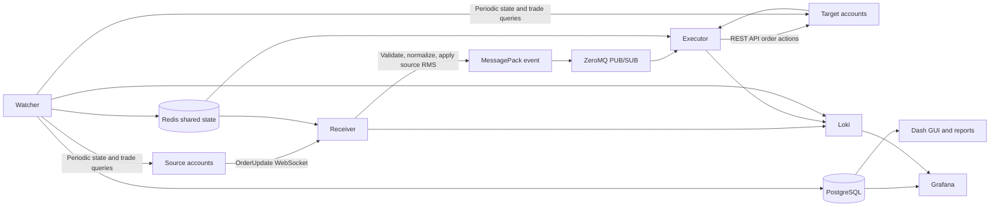

# TradeManager
## Project Roadmap and Final Product Report

**Prepared by:** `Gaston Solari Loudet`  
**Reporting period:** `01/22/2024 - 04/10/2024`  
**Project status:** `Stable, in production`

**GitHub link**: https://www.github.com/gsolaril/tmgr 

## Table of Contents

1. [Executive Summary](#1-executive-summary)
2. [Project Background and Objectives](#2-project-background-and-objectives)
3. [Roadmap](#3-roadmap)
4. [Final Architecture](#4-final-architecture)
5. [Technical Requirements and Implemented Features](#5-technical-requirements-and-implemented-features)
6. [Final Assessment](#6-final-assessment)
7. [Future Roadmap](#7-future-roadmap)

## 1. Executive Summary

TradeManager was a trading-operations platform for replicating trades from source accounts to target accounts while applying configurable risk controls per account and preserving an operational audit trail.

### Key outcomes

- Real-time ingestion of source-account trading events through WebSockets.
- Asynchronous propagation of validated events through ZeroMQ.
- Execution of market, pending, modification, and closure actions through trading REST APIs.
- Support for MetaTrader 4 and MetaTrader 5 through a common internal order model.
- Per-account risk controls, including lot, exposure, position-count, price-range, and stop-loss rules.
- Persistent storage of account state, active and closed trades, API responses, configuration, and changes.
- Periodic reconciliation to detect missing, duplicated, or unmatched trades.
- Dash-based operator interface, generated reports (Telegram), Grafana dashboards, and Loki logging.

The final architecture separates immediate event handling from periodic state correction. This is important in a trading environment: WebSocket events provide responsiveness, while scheduled snapshots provide a corrective view when messages are delayed, duplicated, or lost.

## 2. Project Background and Objectives

### Problem addressed

Managing related positions across several trading accounts manually is slow and error-prone. A single source order may need to be copied to multiple targets, each with its own:

1. Lot-size multiplier.
2. Broker-specific symbol naming convention.
3. Maximum exposure and margin restrictions.
4. Position-count and loss limits.
5. Authentication token and API state.

TradeManager treats the source order as the origin of a controlled group of target trades. The system records those relationships so that operators can determine what was copied, what failed, and whether a target position remains valid.

### Initial objectives

- Automate trade replication across source and target accounts.
- Minimize the delay between source events and target actions.
- Prevent trades that violate configured risk parameters.
- Normalize differences between MT4 and MT5 APIs.
- Maintain durable historical and operational records.
- Provide operators with configuration, intervention, and monitoring tools.

**Project motivation**: The business group consisted of a quant research team, a CFD broker and a prop fund. For the latter two, a couple of liquidity providers (OneZero and Blackwell, between others) were connected to our MetaTrader 5 framework for the retail traders to work with. The quant division then deployed automated trading strategies directly into the liquidity providers seizing direct market access (less commissions, sub-millisecond latencies, seven-figure volumes per day).

The TradeManager was our opportunity to scale up the business: selected account owners with larger capitals could copy our institutional-grade trades done with direct market access, while still held within the retail trading layer. The business would keep a percentage of the returns, while paying lower commissions and spreads due to higher trade volumes.

## 3. Roadmap 

The repository supports the following logical development stages. Replace this conceptual sequence with the actual chronology where possible. Dates between Jan 2024 and Apr 2024:

| Stage | Start | End | Main objective | Planned behavior | Result |
| --- | --- | --- | --- | --- | --- |
| 1. Messaging medium | 01/29 | 02/02 | Preselect, measure and compare different resources to communicate between Python services, as well as message serialization | Choice based on highest speed, throughput and least coupling | ZeroMQ PUBSUB connecting 2 nodes data-trade with exclusive port |
| 2. Architecture & API | 02/05 | 02/12 | Design async source-receiver -> target-executor pattern | Use proprietary MT4 & 5 API; Websockets for receiving event-on-trade messages from source accounts, REST for executing replicated trades on target | Pipeline layout, message/JSON parsing, complete profiling for delay and slippage measurement |
| 3. Database design | 02/13 | 02/27 | Create fundamental tables in PostgreSQL for both input/output operations | Input: on TradeManager settings, source-target account relationships, risk management. Output: Order/trade-related event history, account state history (e.g.: Balance, margin, etc). Other: cross-venue (server) asset specifications |
| 4. Basic monitoring | 02/28 | 03/01 | Visualization, analysis and reporting media | Interfaces for account monitoring and source-target trade relationships | 3 Grafana dashboards: (1) per-account, per-symbol & net state variables (balance, uPNL, exposure), (2) source-target current trade ID correspondence, (3) profiling & delay statistics (per-stage within pipeline). |
| 5. Risk management | 03/04 | 03/07 | Apply risk management controls per individual account and per account category | Restriction on currency exposure, asset category, net trade size, price bands, global delay tolerance (for later HFT), volatility indicators (e.g.: VIX) | Larger "accounts" master table with all mentioned controlling accounts. External indicators later integrated as peripheral datasources. |
| 6. Reconciliation | 03/08 | 03/25 | Compare actual trades on source vs. on target, execute regulating actions if applicable | Retry unopened trades given a time tolerance, Scan and force-close unclosed trades every N seconds | Independent "Watcher" node as an object comparing trade books on Redis with the ones retrievable from API. |
| 7. Other integrations | 03/26 | 04/09 | Additional tools for easier configuration and monitoring | Controller GUI for directors & account counselors, Alerts and reporters for team, etc | GUI in Dash (hosted in same server), Telegram bot publishing Grafana dashboard screenshots on selected chat groups. |
| 8. Upscaling | 04/10 | 2025 | Partial redevelopment & integration on actual future trading ecosystem | Extraction of Receiver, Executor and Watcher nodes as separate microservices | **TradeManager V2** on 2025 implemented Receiver & Executor as a simple "meta-strategy": No predictive logic; just monitored all accounts and executed necessary copy-trades, programmed with the same SDK as the rest of the strategies. |

## 4. Final Architecture

The schematic of the complete architecture can be found on the file "<code>misc/TMGR.drawio</code>". A screenshot can be seen here...

### Runtime responsibilities

| Component | Responsibility | Important behavior |
| --- | --- | --- |
| **Receiver** | Consume source-account events. | Parses JSON, filters invalid events, maps symbols, applies source RMS, rejects duplicates, and publishes compact messages. |
| **Executor** | Create target-account actions. | Rebuilds events, selects the correct order class, applies multipliers and target RMS, executes concurrently, and records responses. |
| **Watcher** | Maintain system state and reconciliation. | Refreshes tokens, queries account snapshots, computes exposure, stores history, rebuilds the order map, and handles unmatched trades. |
| **StreamBase** | Provide shared node infrastructure. | Manages configuration, PostgreSQL, Redis, ZeroMQ, symbol specifications, and scheduled tasks. |

### Processing sequence

1. A source trading engine emits an `OrderUpdate` event.
2. The Receiver parses the event and extracts the relevant order action.
3. The source symbol is converted to a standard symbol representation.
4. Source-side restrictions are evaluated.
5. The accepted event is encoded with MessagePack and published through ZeroMQ.
6. Executor workers decode the event and select the corresponding target action.
7. The Executor resolves target accounts, symbol mappings, lot multipliers, and target-side limits.
8. REST requests are sent to eligible target accounts, potentially concurrently.
9. API responses are normalized and recorded with source and target identifiers plus timing data.

**Extra**: In parallel, the Watcher periodically compares live account data (API) with the stored order map (Redis) and initiates corrective handling when required.

## 5. Technical Requirements and Implemented Features

### Integration and compatibility

- MT4 and MT5 support through platform-specific field dictionaries.
- HTTP requests for trading actions and WebSocket subscriptions for event delivery.
- Configurable API endpoints and runtime parameters through environment variables and `_defaults.ini`.
- Standard-to-server symbol mapping for broker suffixes and naming differences.

### Risk management

- Maximum signal lots and net lots.
- Maximum margin in absolute and percentage terms.
- Maximum loss in absolute and percentage terms.
- Maximum exposure and position count.
- Price-range limiting and optional stop-loss enforcement.
- Symbol ignore lists and trade inversion options.
- Duplicate-ticket detection to reduce repeated execution.

### State and persistence

PostgreSQL tables cover the main operational entities:

- Accounts, brokers, and global configuration.
- GUI authentication and configuration change history.
- Symbol specifications and source-target multipliers.
- Active trades, closed trades, missed trades, and deposits.
- Account-state time series and API response history.

Redis provides low-latency shared state for tokens, position counts, lot counts, exposures, price bands, and order mappings. This avoids forcing every node to repeatedly query the trading API for values that must be available during event processing.

### User interface and reporting

The Dash GUI provides the following operational areas:

1. Login and access-level handling.
2. Account management.
3. Global configuration.
4. Source-target multiplier management.
5. Manual trade operations.
6. Change-log review.

The reporting utilities generate:

- Profit, margin, and order-count time series.
- Exposure and lot-distribution charts.
- Source-target order-relationship grids.

Grafana and Loki extend this view with live metrics, request failures, processing delays, and application logs.

### Evidence available in the repository

- Endpoint tests for account and trading operations.
- ZeroMQ, RabbitMQ, and message-queue experiments.
- WebSocket parsing tests.
- Order-encoding tests.
- Asynchronous execution tests.
- MT4 and MT5 JSON fixtures for market and pending orders.
- CSV fixtures for active and closed trades.
- Scripts for sending and closing multiple orders.
- Response-delay analysis and report generation utilities.

### Operational considerations

- PostgreSQL tables must be created before the application is started.
- PostgreSQL, Redis, Grafana, and Loki must be reachable with valid network configuration.
- Docker Compose is the intended production-oriented runtime path.
- Individual nodes can be run separately for testing, but ports and shared state must be isolated.
- Multiple Receivers and Executors using the same account configuration can create duplicate trades; deployment boundaries must therefore be controlled.

## 6. Final Assessment

### Delivered value

- Converts a complex multi-account workflow into a structured event pipeline.
- Separates ingestion, execution, and reconciliation responsibilities.
- Makes risk restrictions configurable rather than hard-coded per account.
- Preserves source-to-target traceability and API timing information.
- Combines real-time processing with periodic correction.
- Provides both operator-facing controls and technical observability.

### Remaining risks and technical debt

- Secret values should be moved from example configuration into a secure secret-management solution.
- Restart-safe idempotency and duplicate prevention should be tested more extensively.
- Container health checks and deployment isolation should be strengthened.
- Recovery behavior for reconnects, timeouts, partial fills, and inconsistent snapshots requires systematic testing.
- Production readiness should be measured using explicit indicators such as replication success rate, event latency, reconciliation drift, and unresolved-trade count.

### Results & Conclusions

By late April / early May 2024, the TradeManager was already managing more than 100 accounts and became the main technological asset within the know-how of the business as a quant investment fund. The later trading ecosystem (both MFT-focused during 2024 and HFT-focused during 2025) executed trades on the source-designated accounts (usually A-book demos), to which the TradeManager's Receiver node seamlessly reacted and triggered the copying chain, without the need for executing any kind of direct trades on investors' accounts.

Such structure also became a starting point to separate the business resources & infra into:
- Fund-related: used by quant researchers and developers. Strategies, predictors, indicators, data analytics, purpose-specific risk managers.
- Investor-related: used by directors and account managers. TradeManager and related GUIs, CRMs, support interfaces, later website back-end.

**Some metrics by second half of 2024**:
- 153 accounts managed and supervised by TradeManager (32 sources + 121 targets)
- Total managed capital ranged between 4.5 (June) and 8.5 million USD (October)
- 980k trades opened and closed throughout the system in approx 120 trading days.
- Late July: 8 strategies in-production traded at the same exact time of the day (1:30 PM UTC+0)
  - Caused 72 trades during a 5-second interval throughout the ~150 accounts = 10800 trades.
  - = 2.16 trades per millisecond with wire-to-wire delay below 200 microseconds.
  - = 56% idle time under critical load: as designed, the system could still bear double the trades.

## 7. Future Roadmap

**Essential**:
1. **Harden credential and secret management**: Passwords and tokens can't be explicitly stored in database, within the accounts' table. They require encryption. Use Hashicorp's Vault to store them as secrets, and let the password field in the accounts' table to map towards such secrets once access to Vault is previously validated.

**Recommended**:
1. **Extend strategy support and broker/API adapters**: Legacy Receiver and Executor frameworks rely too much on MT5 API, while most other trading exchanges do feature similar APIs. TradeManager V2 would let I/O operations be generalized and for the API endpoints to be replaced by per-exchange peripheral connectors within the 2025 ecosystem.
2. **Move configuration from PostgreSQL to MongoDB**: non-tabulated structure allows for more scalable free-shaped sources. Also features reactive change-on-table notifiers (no need to poll the source to detect changes).
3. **Design backoffice accessible from company website**: to allow authorized investors to customize their own risk parameters on owned accounts, independently from directors and quant team. Also allowing new features such as discretionary trading, emergency stops and hedging between others.
4. **Telegram/Slack channels featuring input commands**: slash commands to interact with actual TradeManager when away from keyboard (e.g.: `/get_report report=delays hours=3`, `/close_all_trades accounts=12345,23456,34567`, etc)

**Exploratory**:
1. **TradeManager V2 collocation**: service to be hosted on bare-metal server close to trading venue for faster response. HFT copy-trading is conceptually subjected to the data-to-trade pipeline twice. Pretend the 2nd time to cause the least additional delays as possible.
2. **TradeManager V2 deployment patterns**: same controller database for all instances, adjustable account categories based on location where the TM instance is currently hosted (which server, which colo, which provider)
