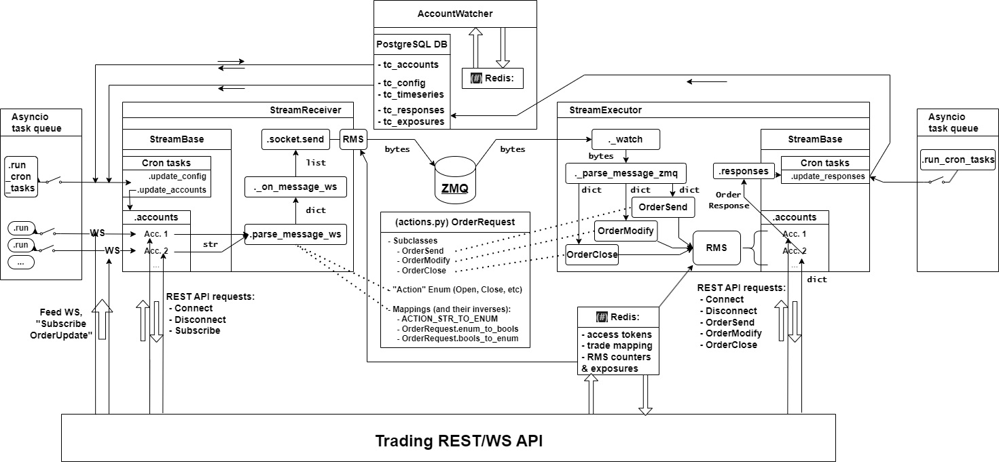

<hr><h2><center><u><b>TradeManager</b></u></center></h2>

<p>The purpose of this project is to provide a reliable system that can take care of replicating trades from a series of master accounts to slave accounts, given a set of risk parameters and custom restrictions. In a nutshell, it consists on a "triangular" structure of 3 objects which interact bidirectionally to keep control and record of each one of the trades among the different accounts, and also their dependencies.</p>

<p>Together with a purposefully-designed GUI based on Python/Dash, the usage of all of its features allow the construction of a complete tree of non-redundant relationships between master accounts, slave accounts, and/or a combination of both. It enables full interaction and two-way responsiveness upon any trading engine through the use of both (timed) sync and async functionalities.</p>

<hr><h3><u><b>Structure</b></u></h3>

<p>The schematic of the complete architecture can be found on the file "<code>misc/TMGR.drawio</code>". A screenshot can be seen here...</p>
<center></center>

<p>The 3 blocks that control the system are:</p>
<ol><li>The "<b><u>Receiver</u></b>" ("<code>core/receiver.py</code>") connects through an array of <b>WebSockets</b>, each one of them belonging to a master account ("<code>core/account.py</code>"). Thus receiving instant notifications on the execution, modification or exit event of each master trade (called "<b>source</b>"). It has its own master-based RMS.
</li><li>The "<b><u>Executor</u></b>" ("<code>core/receiver.py</code>") receives the appropriately processed notifications and manage the replication of the events' actions through the trading <b>REST API</b> and a slave-based RMS. The responses are recorded so as to keep track of the current risk state of the slave accounts.
</li><li>The "<b><u>Watcher</u></b>" ("<code>core/watcher.py</code>") keeps track of whatever happens on the master and slave accounts, storing all of the state-based data to a time-series database. It also compensates and corrects any type of short-term discrepancy between the trading engine's records and the Receiver/Executor. It can also enforce safety measures such as closing "loose" trades and sending reconnection signals to WebSockets whenever needed.
</li></ol>

<b><u>Important components:</u></b>
<ul><li>A "<b><u>PostgreSQL</u></b>" database for controlling inputs (accounts, general config), recording state variables (equity, margin, trade count, exposure) as well as registering events (opened orders, withdrawals/deposits, API responses, profiling/delays, etc.)
</li><li>A "<b><u>Redis</u></b>" instance for interaction between the Watcher and the Receiver/Executor. Mostly used for providing information and validation to the aforementioned state variables of the accounts so that both nodes are updated with the latest information at all times.
</li><li>A "<b><u>ZMQ</u></b>" pub-sub pattern for communication between Receiver (PUB) and Executor (SUB) with persistence. Messages are encoded into minimal-size data types to ensure swift transmission without loss.
</li><li>A "<b><u>Grafana</u></b>" instance for real-time data visualization, including one external "<b><u>Loki</u></b>" container for logging and error handling.
</li><li>A Dash-based web "<b><u>GUI</u></b>" for account, risk and config management.
</li></ul>

<b><u>Please note:</u></b> Any kind of <b><u>REST/WS API wrapper</u></b> must be accordingly adapted to the "<code>core/utils.py</code>" file for compatibility with the chosen trading engine.

<hr><h3><u><b>Dependencies</b></u></h3>

<p>The system relies on the Poetry dependency framework, so the required packages are contained in the "<code>pyproject.toml</code>" file. The download of such modules is managed by Poetry itself, though it's strongly recommended to create a virtual environment with such for testing purposes.</p>

<p>Production runtime requires a Docker environment. The main TradeManager image as well as the GUI are built from a "<code>"docker-compose.yaml"</code>" file. As long as network hosts/ports are adequately adjusted, multiple instances of TradeManager can be launched if this file is modified with other image specifications (e.g.: for testing or account isolation).</p>

<hr><h3><u><b>How to run</b></u></h3>

<b><u>For production mode</u></b>:
1. Get the aforementioned components installed and running as containers: PostgreSQL, Redis and Grafana/Loki. Make sure to expose the ports correctly, and to detach the containers for further safety.
```
docker run --build -d -p [internal port]:[exposed port] --name [custom name] [image name]
```
2. Connect each one of them into a Docker network, sequentially. Then take note of the internal network IPs of such containers and modify the YAML file accordingly.
```
docker network connect [name of network] [name of container]
docker inspect [name of network]
```
3. Create each one of the necessary tables in the PostgreSQL database. The "<code>CREATE</code>" queries in "<code>misc/pg-create-tables.sql</code>" can be used. It's strongly recommended for a Database manager such as DBeaver or DataGrip to be used for this.<br><br>
4. Build and launch the Docker compose YAML while in the repo directory:
```
docker-compose up --build --no-log-prefix
```
<p><b><u>For testing mode</u></b>: each one of the nodes can be run separately while production is running. Just make sure that the scripts are executed independently and that the ports for ZMQ and Redis are changed.</p>

```
poetry build
poetry run python core/[receiver|executor|watcher].py
```
<p>Also <b><u>be warned about</u></b> the fact that parallel runtime of multiple receivers and executors upon the same account table might create <b><u>duplicate trades</u></b>. It's <b><u>strongly recommended for them to be tested one at a time</u></b>.</p>